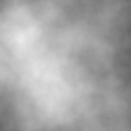
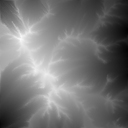

# Rainfall

Go language implementation of https://github.com/Vehxx/Rainfall Java repository

### Overview

Go implementation of a particle-based hydraulic erosion simulation algorithm. The program accepts a heightmap in the form of a 2D slice`[x][y]float64` in range **[-1, 1]** or `image.Image` and returns a 2D slice or `image.Image`.

[FastNoiseLite](https://github.com/Auburn/FastNoiseLite/tree/master/Go) or any noise generator can be used to create the fractal noise passed to the algorithm.

Below is a render of a 512x512 grid of fractal noise which was run through the program with the default parameters. This simulation was allowed to run for 2 million iterations.


Because flow of the simulated raindrops across the terrain emulates real-life physics, geographical features which are present in real terrain manifest in the simulation as well. Features such as gullies on the sides of mountains, sediment-filled valleys, and alluvial fans - where water drains from a narrow passage into a wider area - all appear. 

Here is a 'timelapse' of the heightmap which was passed through the program and used to create the above render. One picture was saved after every 10,000 raindrops were simulated, for a total of 200 frames.


### Options

Rainfall makes use of 5 basic variables which can be changed to achieve different results.

#### Scale

Scale is used as a multiplier for determining the surface normal at any given point. Increasing this value would cause a raindrop to move a farther distance, whereas decreasing it would cause it to move a shorter distance. This is because the scale directly affects the speed of the raindrop. Acceleration = force / mass, and this variable determines the force in that equation.

#### Density

Density is used to calculate the acceleration of the raindrop as it flows across the heightmap. Acceleration = force / mass, and mass is calculated by volume * density. Therefore, increasing the density causes the raindrop to accelerate more slowly.

#### Friction

Friction is a multiplier which effects the speed of the raindrop after it moves across a surface. Higher friction means lower speeds.

#### Evaporation Rate

Evaporation rate is how many times the raindrop can move to a new position before it is terminated. By default, this number is set to the 1 / the length of the X axis.

#### Deposition Rate

Deposition rate is a multiplier which controls how much sediment is deposited to the terrain.

Here is an example of the difference between an output with this value set to 0.3f (default), vs 0.1f, with no other changes.


### Screenshots

Here's a before and after shot of a render of the unprocessed fractal noise vs the same noise which was run through Rainfall:


### Example code

```go
package main

import "github.com/setanarut/rainfall"

func main() {
	opts := &rainfall.Options{
		Scale:              100.0,
		Density:            1,
		Friction:           0.1,
		DepositionRate:     0.3,
		EvaporationRate:    1.0 / 256, // (1/width)
		RaindropRandomSeed: 1923,
	}

	sim := rainfall.NewFromImageFile("noise.png", opts)

	// Raindrops drops the given amount of random raindrops.
	sim.Raindrops(200000)

	sim.WriteToImageFile("noise_out.png")
}
```

input and output images




