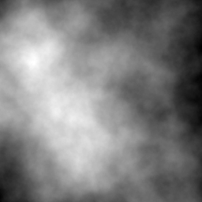

# rainfall
Simulation of hydraulic erosion across a heightfield


```go
package main

import "github.com/setanarut/rainfall"

func main() {

    opts := &Options{
		Scale:          100.0,
		Density:        1.0,
		Friction:       0.1,
		DepositionRate: 0.3,
		EvaporationRate:    1.0 / 512, // (1/width)
		RaindropRandomSeed: 1923,
	}

	sim := rainfall.NewFromImageFile("noise.png", opts)
	sim.Raindrops(200000)
	sim.WriteToImageFile("noise_out.png")
}
```

### input grayscale heightmap image



### after 200000 raindrops iteration

